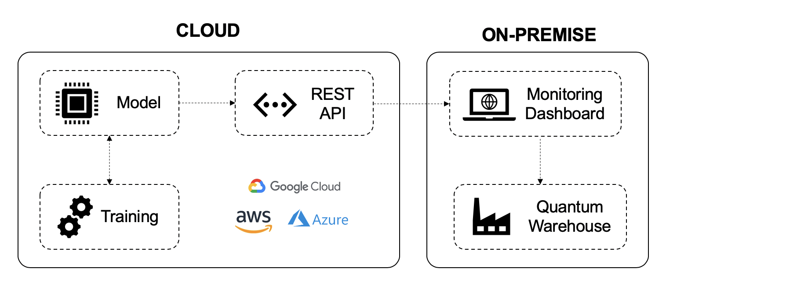

# Quantum Warehouse
> Reinforcement Learning architecture to automate long term planning of warehouse inventory for enterprise deployment.

[](https://www.codefactor.io/repository/github/guptajay/quantum-warehouse/overview/development)

## Documentation
All documentation is available in the GitHub Wiki [here](https://github.com/guptajay/Quantum-Warehouse/wiki). 

## Introduction
Warehouse owners face the problem of a high land lease yet limited storage efficiency. Price ranges from $2 to $5 per sqaure feet around Singapore. There are logistical issues such as fluctuating manpower in terms of supply and demand. Operations of conventional warehouse are unable to keep up with growth experienced by e-commerce. There was a 24.5% increase in e-commerce sales in Singapore in 2020 compared to 2019. There is a need for more efficient picking and packing order. 

Quantum Shelves is system of motorized shelves that translates along a single axis to generate dynamic pathways when needed; collapse into space-saving configuration when not needed. Each shelf is powered by multiple threaded mobile module at its base and stabilized by a network of motorized levers at its top for safety. This setup increases the overall storage volume by 34% as compared to conventional facilities

## Installation

### MongoDB Database Setup
> Navigate to data/config.py

```
USERNAME = "YOUR_USERNAME"
PASSWORD = "YOUR_PASSWORD"
DATABASE_NAME = "warehouse"
```

### Run (macOS & Linux)
> Python 3.7.4 should be installed in the system. 
> You should be outside the root directory `Quantum-Warehouse`

```
python3 -m venv env 
source env/bin/activate
pip install -r Quantum-Warehouse/requirements.txt
```

```
cd Quantum-Warehouse
python main.py
```

## Scope


