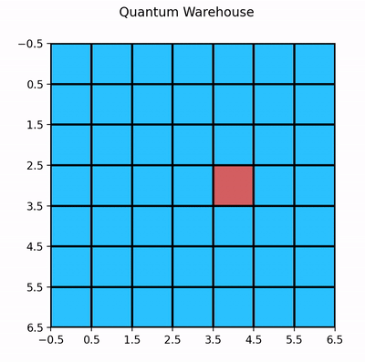
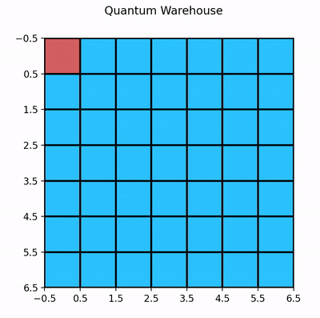
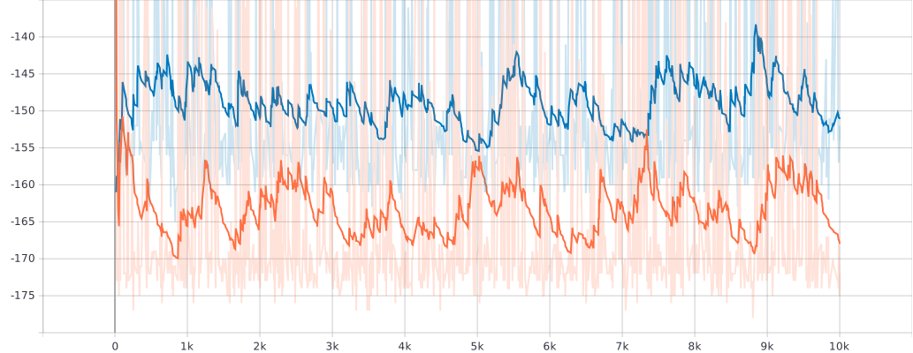

## Policies

### Random Policy
> Selects a random shelve in the warehouse.
```
# /Quantum-Warehouse
python main.py random_policy
```


### Baseline Policy
> Slects the outermost shelf available in the warehouse.
```
# /Quantum-Warehouse
python main.py baseline_policy
```


### Visualize with TensorBoard

```
tensorboard --logdir logs
```

### Policy Comparison (Baseline vs Random)

* **Blue** : Baseline Policy
* **Red** : Random Policy



**X-Axis** : Reward, **Y-Axis** : Episode Number