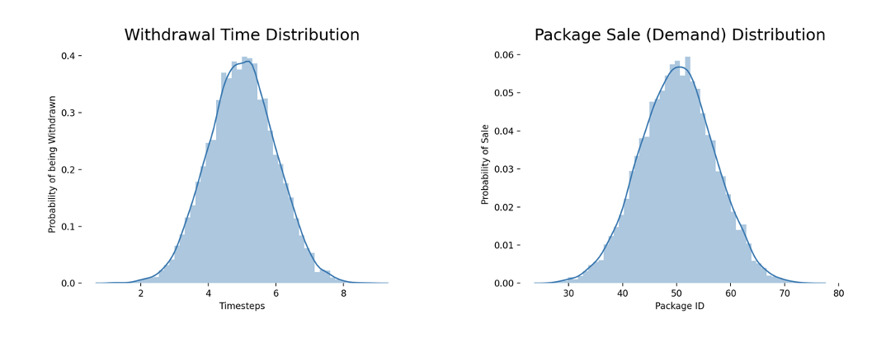

## Overview

### Description
A warehouse is built in the form of a 7 x 7 grid, where each location in the grid can be used to store a package. Only one package can be stored at each location. It becomes more expensive to store and retrieve packages as we go deeper inside the grid. 

### Source
This environment corresponds to a version of Quantum Warehouse. 

## Environment
### Warehouse Grid

|  1 D = 0 R = -1 |  2 D = 0 R = -1 |  3 D = 0 R = -1 |  4 D = 0 R = -1 |  5 D = 0 R = -1 |  6 D = 0 R = -1 |  7 D = 0 R = -1 |
|:---------------------:|:---------------------:|:---------------------:|:---------------------:|:---------------------:|:---------------------:|:---------------------:|
| 24 D = 0 R = -1 | 25 D = 1 R = -2 | 26 D = 1 R = -2 | 27 D = 1 R = -2 | 28 D = 1 R = -2 | 29 D = 1 R = -2 |  8 D = 0 R = -1 |
| 23 D = 0 R = -1 | 40 D = 1 R = -2 | 41 D = 2 R = -3 | 42 D = 2 R = -3 | 43 D = 2 R = -3 | 30 D = 1 R = -2 |  9 D = 0 R = -1 |
| 22 D = 0 R = -1 | 39 D = 1 R = -2 | 48 D = 2 R = -3 | 49 D = 3 R = -4 | 44 D = 2 R = -3 | 31 D = 1 R = -2 | 10 D = 0 R = -1 |
| 21 D = 0 R = -1 | 38 D = 1 R = -2 | 47 D = 2 R = -3 | 46 D = 2 R = -3 | 45 D = 2 R = -3 | 32 D = 1 R = -2 | 11 D = 0 R = -1 |
| 20 D = 0 R = -1 | 37 D = 1 R = -2 | 36 D = 1 R = -2 | 35 D = 1 R = -2 | 34 D = 1 R = -2 | 33 D = 1 R = -2 | 12 D = 0 R = -1 |
| 19 D = 0 R = -1 | 18 D = 0 R = -1 | 17 D = 0 R = -1 | 16 D = 0 R = -1 | 15 D = 0 R = -1 | 14 D = 0 R = -1 | 13 D = 0 R = -1 |

* D = Depth
* R = Reward

### Observation
Type: Box(3)

Num | Observation | Min | Max
---|---|---|---
0 | Index (Location) in Warehouse | 1 | 49
1 | Status of Occupancy | 0 (Vacant) | 1 (Occupied)
2 | Package ID | 20 | 80

### Actions
Type: Discrete(49)

Num | Action
--- | ---
1 | Insert package at location 1
2 | Insert package at location 2
.. | ..  
49 | Insert package at location 49

Note:
* The agent can only insert a package. It is withdrawn automatically by the environment.
* Only one package can be kept at a shelf.
* Every shelf has only one level. 

### Package Withdrawal Scheme
The packages are withdrawn automatically by the environment after a number of timesteps `WITHDRAW_TIME` (normally distributed - configurable). This package withdrawal scheme follows a normal distribution with a mean of 50 and a standard deviation of 7, both configurable.

The environment accepts packages of IDs between 20 and 80. From the distribution, we can observe that packages with IDs between 40 and 60 are sold and thus withdrawn, most often. From the figure on the left, the timesteps after which a package is withdrawn in also normally distributed. We can observe that the warehouse tries to withdraw a package often after between 4 to 6 timesteps.

 

### Reward
The reward is -1 per depth level in the warehouse grid.

### Starting State
The warehouse is empty. 

### Episode Termination
There are no more packages to insert in the warehouse.